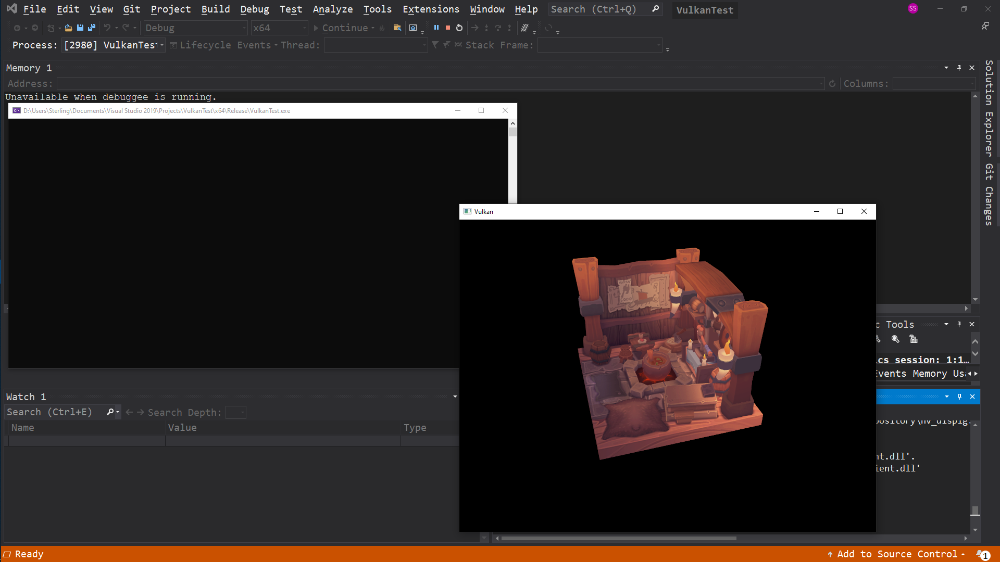

# Vulkan Renderer
Vulkan Renderer[Complete] from the Vulkan-tutorial pages ([Link](https://vulkan-tutorial.com/Introduction)).

## Topics Covered:
* Drawing a triangle
* Vertex Buffers
* Uniform Buffers
* Texture mapping
* Depth buffering
* Loading models
* Generating mipmaps
* Multisampling

###### Note: Model by [nigelgoh](https://sketchfab.com/nigelgoh), not designed to be viewed from rear.

