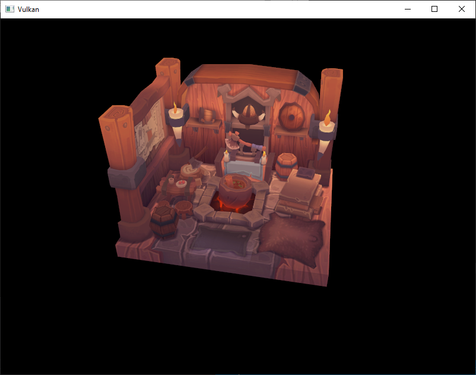

# Vulkan Renderer
Vulkan Renderer[Complete] from the Vulkan-tutorial pages (https://vulkan-tutorial.com/Introduction).

## Topics Covered:
* Drawing a triangle
* Vertex Buffers
* Uniform Buffers
* Texture mapping
* Depth buffering
* Loading models
* Generating mipmaps
* Multisampling

